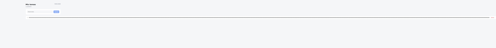
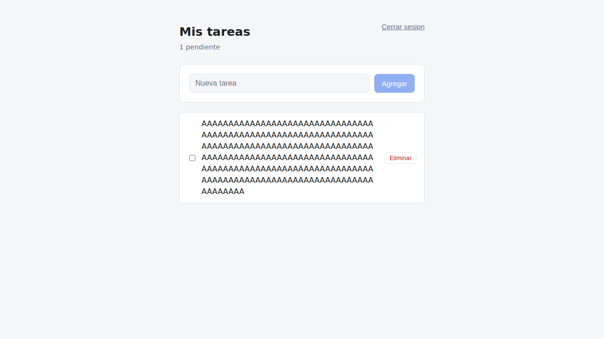

# Reporte de bugs - Gestor de Tareas

Testing exploratorio sobre el
[gestor de tareas](https://github.com/eduardo-mr1/proyectos-de-programacion)
(API en Node/Express + cliente en React).

**8 hallazgos confirmados**, cada uno con pasos de reproduccion y un script que
lo demuestra. Ninguno es hipotetico: todos fueron ejecutados contra la
aplicacion corriendo.

> **Estado: los 8 corregidos y verificados.**
> El equipo de desarrollo (el mismo, en este caso) los corrigio en
> [este pull request](https://github.com/eduardo-mr1/proyectos-de-programacion/pull/6),
> con 12 pruebas de regresion nuevas. Cada hallazgo indica abajo el commit que
> lo resuelve y como se verifico el cierre.

## Entorno

| | |
|---|---|
| Fecha de ejecucion | 5 de septiembre de 2026 |
| API | Node 22 / Express 5 / SQLite, `http://localhost:3000` |
| Frontend | React 18 / Vite 5, `http://localhost:5173` |
| Navegador | Chromium (Playwright), viewport 1280x720 |
| Metodo | Exploratorio manual sobre la API con `curl` + exploratorio automatizado sobre la interfaz con Playwright |

## Resumen

| ID | Hallazgo | Severidad | Componente | Estado |
|---|---|---|---|---|
| [BUG-001](#bug-001) | El email distingue mayusculas: se crean cuentas duplicadas y el login falla | **Alta** | API / Auth | ✅ [Resuelto](https://github.com/eduardo-mr1/proyectos-de-programacion/commit/8091df9) |
| [BUG-002](#bug-002) | Sin limite de intentos de login: permite fuerza bruta | **Alta** | API / Seguridad | ✅ [Resuelto](https://github.com/eduardo-mr1/proyectos-de-programacion/commit/81ff09b) |
| [BUG-003](#bug-003) | Sin longitud maxima en el titulo: rompe el layout | Media | API + UI | ✅ [Resuelto](https://github.com/eduardo-mr1/proyectos-de-programacion/commit/61295bf) |
| [BUG-004](#bug-004) | La API acepta titulos formados solo por espacios | Media | API / Validacion | ✅ [Resuelto](https://github.com/eduardo-mr1/proyectos-de-programacion/commit/61295bf) |
| [BUG-005](#bug-005) | Politica de contrasena debil: acepta `123456` | Media | API / Seguridad | ✅ [Resuelto](https://github.com/eduardo-mr1/proyectos-de-programacion/commit/8091df9) |
| [BUG-006](#bug-006) | `done` entra como booleano y sale como entero | Baja | API / Contrato | ✅ [Resuelto](https://github.com/eduardo-mr1/proyectos-de-programacion/commit/61295bf) |
| [BUG-007](#bug-007) | `GET /tasks` sin paginacion | Baja | API / Escalabilidad | ✅ [Resuelto](https://github.com/eduardo-mr1/proyectos-de-programacion/commit/61295bf) |
| [BUG-008](#bug-008) | El checkbox no responde hasta que contesta el servidor | Baja | UI / UX | ✅ [Resuelto](https://github.com/eduardo-mr1/proyectos-de-programacion/commit/c914f97) |

Criterio de severidad: **Alta** = perdida de acceso a datos propios o riesgo de
seguridad explotable. **Media** = datos invalidos persistidos o degradacion
visible. **Baja** = inconsistencia de contrato o friccion de uso.

## Como reproducir

```bash
# API de la aplicacion corriendo en :3000
cd ../proyectos-de-programacion/api-gestor-tareas && npm install && npm start

# En otra terminal, los hallazgos de la API:
./reproduccion/api-bugs.sh
```

---

## BUG-001
### El email distingue mayusculas: se crean cuentas duplicadas y el login falla

**Severidad:** Alta &nbsp;·&nbsp; **Componente:** API / Auth

**Pasos**

1. Registrar `usuario@test.com` con cualquier contrasena.
2. Registrar `Usuario@test.com` con la misma contrasena.
3. Intentar iniciar sesion con `USUARIO@test.com`.

**Resultado esperado**

El paso 2 responde `409 El email ya esta registrado`. El paso 3 inicia sesion
correctamente: para un usuario, las tres formas son el mismo correo.

**Resultado real**

- Paso 2: `HTTP 201`. Se crea una **segunda cuenta independiente**.
- Paso 3: `HTTP 401 Credenciales invalidas`.

**Impacto**

Es el hallazgo mas grave del reporte. Un usuario que se registra desde el
teclado del celular (que capitaliza la primera letra por defecto) y luego
inicia sesion escribiendo en minusculas recibe "credenciales invalidas" y
concluye que olvido su contrasena. Si vuelve a registrarse, entra a una cuenta
vacia y sus tareas parecen haberse borrado.

**Causa**

`src/routes/auth.js` guarda el email tal cual llega, y la consulta
`SELECT * FROM users WHERE email = ?` en SQLite compara texto respetando
mayusculas.

**Sugerencia**

Normalizar a minusculas antes de guardar y de consultar
(`email.toLowerCase()`, o `zod` con `.transform(s => s.toLowerCase())`), y
declarar la columna como `TEXT COLLATE NOCASE` para que la restriccion `UNIQUE`
tambien lo respete.

**Verificacion de cierre** &nbsp;·&nbsp; [`8091df9`](https://github.com/eduardo-mr1/proyectos-de-programacion/commit/8091df9)

El email se normaliza a minusculas en el esquema de `zod` antes de guardar y de
consultar, y la columna pasa a `TEXT UNIQUE NOT NULL COLLATE NOCASE`.

Reverificado: registrar `CASO@test.com` sobre un `caso@test.com` existente ahora
responde `409`, y el login con `PeRsOnA@test.com` responde `200`. Cubierto por
tres pruebas de regresion en `test/regresiones.test.js`.

---

## BUG-002
### Sin limite de intentos de login: permite fuerza bruta

**Severidad:** Alta &nbsp;·&nbsp; **Componente:** API / Seguridad

**Pasos**

1. Enviar 30 peticiones `POST /auth/login` seguidas con contrasena incorrecta
   para un email existente.

**Resultado esperado**

Tras unos pocos intentos fallidos, la API responde `429 Too Many Requests` o
introduce un retraso creciente.

**Resultado real**

Los 30 intentos responden `401` en **2 segundos**, sin bloqueo ni retraso. A ese
ritmo (~15 intentos por segundo, sin paralelizar) un diccionario de contrasenas
comunes se agota en minutos.

**Agravante**

Se combina con BUG-005: la API acepta `123456`, que esta en el primer lugar de
todas las listas de contrasenas filtradas.

**Sugerencia**

Limitar por IP y por cuenta (`express-rate-limit` o equivalente), por ejemplo 5
intentos fallidos por cada 15 minutos, y responder siempre en tiempo constante
para no filtrar si el email existe.

**Verificacion de cierre** &nbsp;·&nbsp; [`81ff09b`](https://github.com/eduardo-mr1/proyectos-de-programacion/commit/81ff09b)

Limitador de 5 intentos fallidos por email cada 15 minutos, con cabecera
`Retry-After`. Se agrupa por email y no por IP para que rotar de IP no evada el
limite.

Al escribir la prueba de regresion aparecio un hueco en la propia correccion: la
ruta devolvia `401` **sin registrar el intento** cuando fallaba la validacion del
esquema, asi que bastaba mandar siempre una contrasena invalida para que el
contador nunca subiera. Corregido en el mismo cambio.

---

## BUG-003
### Sin longitud maxima en el titulo: rompe el layout

**Severidad:** Media &nbsp;·&nbsp; **Componente:** API + UI

**Pasos**

1. Iniciar sesion.
2. Crear una tarea con un titulo de 600 caracteres sin espacios.

**Resultado esperado**

La API rechaza titulos por encima de un limite razonable (por ejemplo 200
caracteres), o la interfaz corta el texto con `text-overflow`.

**Resultado real**

- La API acepta incluso 5000 caracteres: `HTTP 201`.
- La interfaz estira la pagina a **7358 px de ancho** en una ventana de
  **1280 px**. El encabezado y el formulario quedan comprimidos a la izquierda y
  aparece scroll horizontal en toda la pagina.

**Evidencia**



**Sugerencia**

Dos capas: validar `z.string().min(1).max(200)` en la API, y en el CSS agregar
`overflow-wrap: anywhere` al titulo de la tarea para que ningun contenido pueda
desbordar el contenedor.

**Verificacion de cierre** &nbsp;·&nbsp; [`61295bf`](https://github.com/eduardo-mr1/proyectos-de-programacion/commit/61295bf) (API) y [`d1f75d8`](https://github.com/eduardo-mr1/proyectos-de-programacion/commit/d1f75d8) (CSS)

Se corrigio en las dos capas: la API rechaza titulos de mas de 200 caracteres, y
el CSS usa `overflow-wrap: anywhere` con `min-width: 0` para que ningun
contenido pueda desbordar su contenedor flex.

Reverificado con un titulo de 200 caracteres sin espacios: `scrollWidth` = 1280
= `innerWidth`. Antes era 7358.



---

## BUG-004
### La API acepta titulos formados solo por espacios

**Severidad:** Media &nbsp;·&nbsp; **Componente:** API / Validacion

**Pasos**

1. `POST /tasks` con `{"title": "     "}`.

**Resultado esperado**

`400 El titulo es requerido`.

**Resultado real**

`HTTP 201`. Se guarda una tarea cuyo titulo son cinco espacios, que en la
interfaz se ve como una fila vacia con su checkbox y su boton de eliminar.

**Nota sobre el alcance**

Desde la interfaz **no** es reproducible: el frontend hace `trim()` y deshabilita
el boton. El defecto esta en la API, y afecta a cualquier otro cliente que la
consuma. Es un buen ejemplo de por que la validacion no puede vivir solo en el
frontend.

**Sugerencia**

`z.string().trim().min(1)` en `createSchema`, para que el recorte ocurra antes
de la validacion y antes de persistir.

**Verificacion de cierre** &nbsp;·&nbsp; [`61295bf`](https://github.com/eduardo-mr1/proyectos-de-programacion/commit/61295bf)

`z.string().trim().min(1)`: el recorte ocurre antes de la validacion, asi que un
titulo de puros espacios ahora responde `400`, y `"   Con espacios   "` se guarda
como `"Con espacios"`.

---

## BUG-005
### Politica de contrasena debil

**Severidad:** Media &nbsp;·&nbsp; **Componente:** API / Seguridad

**Pasos**

1. Registrar un usuario con la contrasena `123456`.

**Resultado esperado**

Rechazo, o al menos un minimo mas alto que 6 caracteres.

**Resultado real**

`HTTP 201`. La unica regla es longitud minima de 6, sin comprobar contrasenas
comunes ni exigir variedad de caracteres.

**Sugerencia**

Subir el minimo a 8 y contrastar contra una lista de contrasenas filtradas. Es
mas efectivo que exigir simbolos, que solo empuja a los usuarios hacia patrones
predecibles.

**Verificacion de cierre** &nbsp;·&nbsp; [`8091df9`](https://github.com/eduardo-mr1/proyectos-de-programacion/commit/8091df9)

Minimo de 8 caracteres y rechazo de las 20 contrasenas mas frecuentes en
filtraciones publicas. `123456` y `12345678` ahora responden `400`.

---

## BUG-006
### `done` entra como booleano y sale como entero

**Severidad:** Baja &nbsp;·&nbsp; **Componente:** API / Contrato

**Pasos**

1. `PATCH /tasks/:id` con `{"done": true}`.

**Resultado esperado**

Coherencia: si el campo se envia como booleano, se devuelve como booleano.

**Resultado real**

La respuesta trae `"done": 1` (entero), porque SQLite no tiene tipo booleano y
el valor se devuelve crudo. El esquema de `zod` solo acepta booleano en la
entrada, asi que el contrato es asimetrico.

**Impacto**

Cualquier cliente que haga `if (task.done === true)` falla silenciosamente. En
este frontend funciona solo porque usa `Boolean(task.done)`.

**Sugerencia**

Convertir en la capa de salida: `{ ...task, done: Boolean(task.done) }`.

**Verificacion de cierre** &nbsp;·&nbsp; [`61295bf`](https://github.com/eduardo-mr1/proyectos-de-programacion/commit/61295bf)

La capa de salida convierte con `Boolean(task.done)`, asi que el campo entra y
sale como booleano en `POST`, `PATCH` y `GET`.

---

## BUG-007
### `GET /tasks` sin paginacion

**Severidad:** Baja &nbsp;·&nbsp; **Componente:** API / Escalabilidad

**Descripcion**

La consulta es `SELECT * FROM tasks WHERE user_id = ? ORDER BY id DESC`, sin
`LIMIT` ni `OFFSET`. Un usuario con 10 000 tareas las recibe todas en cada
carga, y el frontend las renderiza todas.

**Sugerencia**

Parametros `limit` y `offset` con un tope por defecto (por ejemplo 50), y
paginacion o scroll incremental en el cliente.

**Verificacion de cierre** &nbsp;·&nbsp; [`61295bf`](https://github.com/eduardo-mr1/proyectos-de-programacion/commit/61295bf)

`GET /tasks?limit=&offset=` con 50 por defecto y 200 como tope. La respuesta
pasa a `{ tasks, total, limit, offset }`, y un `limit` fuera de rango responde
`400`. El frontend quedo adaptado en el mismo pull request.

---

## BUG-008
### El checkbox no responde hasta que contesta el servidor

**Severidad:** Baja &nbsp;·&nbsp; **Componente:** UI / UX

**Pasos**

1. Crear una tarea y hacer click en su checkbox.

**Resultado esperado**

El checkbox se marca de inmediato y revierte si la peticion falla
(actualizacion optimista).

**Resultado real**

El checkbox permanece sin marcar hasta que responde `PATCH /tasks/:id`. En local
son milisegundos; en una red lenta el usuario percibe que su click se ignoro y
tiende a hacer click de nuevo.

**Como se detecto**

Al escribir la suite E2E: `locator.check()` de Playwright falla con
`Clicking the checkbox did not change its state`, porque exige que el estado
cambie inmediatamente despues del click.

**Sugerencia**

Actualizar el estado local antes de la peticion y revertir en el `catch`.

**Verificacion de cierre** &nbsp;·&nbsp; [`c914f97`](https://github.com/eduardo-mr1/proyectos-de-programacion/commit/c914f97)

Actualizacion optimista: el estado local cambia antes de la peticion y se
revierte en el `catch` si la API falla.

Reverificado con la misma prueba que lo detecto: `locator.check()` de Playwright
ahora pasa, porque el checkbox cambia de estado en el mismo click.

---

## Hipotesis descartadas

Documentar lo que **no** resulto ser un bug tambien es parte del trabajo:

| Hipotesis | Resultado |
|---|---|
| Un doble click rapido en "Agregar" crearia la tarea dos veces | **No reproduce.** Se probo con `click({ clickCount: 2 })`: se crea una sola tarea. El campo se limpia despues de la respuesta y el segundo click encuentra el boton ya deshabilitado. |
| La interfaz permitiria crear tareas con titulo vacio | **No reproduce.** El frontend hace `trim()` y deshabilita el boton. El defecto existe pero solo por API (BUG-004). |

## Priorizacion sugerida

1. **BUG-001** primero: es el unico que hace que un usuario pierda acceso a sus
   propios datos, y la correccion es de pocas lineas.
2. **BUG-002 y BUG-005** juntos: se refuerzan mutuamente y ambos son de
   seguridad.
3. **BUG-003 y BUG-004**: validacion de entrada, se resuelven en el mismo
   esquema de `zod`.
4. El resto no bloquea a ningun usuario hoy.
